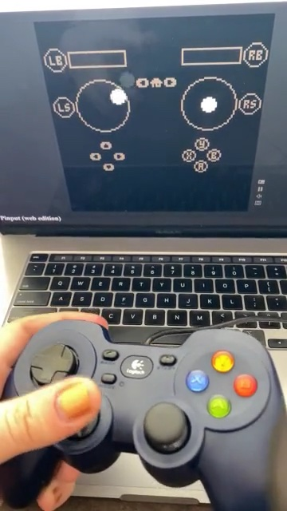
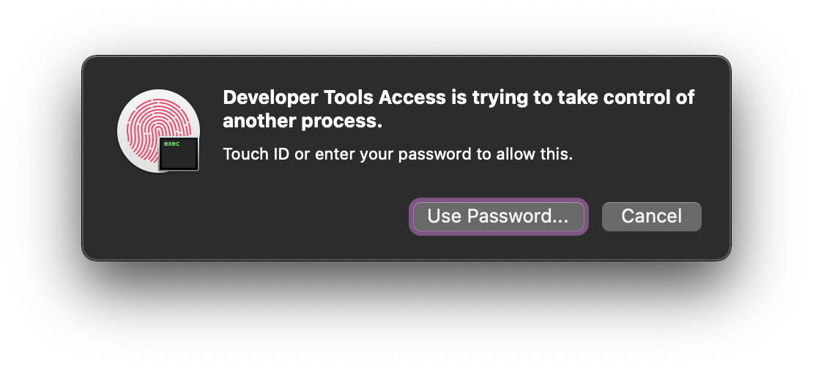

# Pinput


[//]: # (brew install github-markdown-toc)
[//]: # (gh-md-toc --hide-header --hide-footer --start-depth 1 --no-escape README.md)
[//]: # (currently doesn't work; see https://github.com/ekalinin/github-markdown-toc.go/issues/35)

[//]: # (start ToC)

* [Introduction](#introduction)
* [PICO-8 development](#pico-8-development)
* [WASM-4 development](#wasm-4-development)
* [Haptics](#haptics)
* [Instructions](#instructions)
  * [Rust](#rust)
  * [macOS](#macos)
  * [Windows](#windows)
  * [web](#web)
    * [web extension](#web-extension)
* [Current status](#current-status)
  * [Rust](#rust-1)
  * [macOS](#macos-1)
  * [Windows](#windows-1)
  * [web](#web-1)
    * [web extension](#web-extension-1)
* [Future goals](#future-goals)
* [Development notes](#development-notes)
* [Licensing and attributions](#licensing-and-attributions)

[//]: # (end ToC)

## Introduction

Ever wish [PICO-8](https://www.lexaloffle.com/pico-8.php) had dual analog stick support? Me too. Pinput is a Lua library that works with PICO-8's GPIO memory area and an external helper app to provide [XInput](https://docs.microsoft.com/en-us/windows/win32/xinput/getting-started-with-xinput)-like gamepad support to an unmodifed copy of PICO-8. This gets you two analog sticks, two analog triggers, up to 16 digital buttons, and even rumble support, for up to 8 gamepads or haptic devices like vibrators. Pinput supports macOS, Windows, Linux, Chrome, Firefox, and Safari.

[](https://raw.githubusercontent.com/VyrCossont/Pinput/main/docs/Pinput-demo-web.mp4)

*[(Click for video.)]((https://raw.githubusercontent.com/VyrCossont/Pinput/main/docs/Pinput-demo-web.mp4))*

## PICO-8 development

To add Pinput support to your own cartridge, take a look at [`pinput.lua`](PICO-8/pinput.lua). All of the functions and constants prefixed with `pi_` are the Pinput client code proper, and you can copy or `#include pinput.lua` that code right into your cartridge to use it yourself.

Call `pi_init()` to put the Pinput magic bytes into GPIO so one of the helper apps can find it and start communicating, and call `pi_btn()`, `pi_trigger()`, `pi_axis()`, etc. to read button, trigger, and thumbstick axis values. Note that (as in XInput) trigger values are in the range [0, 255] and axes are in the range [-32768, 32767]. Also note that Y axes on thumbsticks are inverted, although I may change this in a future release.

```lua
-- read player 2's left trigger and scale it to [0, 1)
local lt = pi_trigger(pi_lt, 1) >> 8
```

Consult [`pinput_tester.p8`](PICO-8/pinput_tester.p8) (the test cartridge) for more usage examples.

Note that Pinput doesn't try to suppress PICO-8's own gamepad API, and whatever button PICO-8 uses to open the pause menu will still open the menu. However, you can use the undocumented [`poke(0x5f30, 1)`](https://pico-8.fandom.com/wiki/Memory#Draw_state) trick to suppress the menu yourself.

## WASM-4 development

The Rust builds of Pinput now support the [WASM-4](https://wasm4.org/) fantasy console's native runtimes in addition to PICO-8! WASM-4 gets the exact same capabilities as PICO-8: 8 gamepads, analog sticks, triggers, rumble, the works. WASM-4 web runtimes are not yet supported.

See the releases for a test cartridge named `pinput_tester-….wasm`.

Check out [`gamepad.rs` in the WASM-4 Pinput tester cartridge source](WASM-4/pinput_tester/src/gamepad.rs) for Rust structs that describe the in-memory layout of the Pinput gamepads, as well as implementations of `pi_init` and `pi_is_inited`.

The WASM-4 Pinput tester currently uses the 128-byte reserved area starting at `0x0020` for communication with Pinput, because the only thing that uses that area is netplay. Pinput would break netplay by providing an alternate input method that isn't integrated with netcode (much like how you can't use the mouse in a WASM-4 netplay cartridge), and the native runtimes for WASM-4 don't support netplay yet anyway, so there's no conflict. However, you can use _any_ 128-byte area of memory to communicate with Pinput, simply by placing the Pinput magic bytes at the start of it.

## Haptics

Pinput also incorporates support for local haptic devices (currently, vibrators) and haptic servers using [buttplug.io](https://buttplug.io/). Local devices don't require any additional software, but using a haptic server like [Intiface Central](https://github.com/intiface/intiface-central) gives you a nice little GUI for testing devices, diagnostic logging, and also may support future devices that Pinput doesn't have built-in support for.

At the Pinput API level, haptic devices are treated as another kind of gamepad with the `HAPTIC_DEVICE` flag set, and you use the same rumble APIs to control them:

```lua
if pi_flag(pi_haptic_device, gamepad_index) then
  -- The device at gamepad_index is a vibrator.
  -- Set its low-frequency motor to half power.
  pi_rumble(pi_lo, 127, gamepad_index)
end 
```

Pinput does not yet support buttons, sensors, or battery status on haptic devices.

## Instructions


To try it, download the latest release of Pinput for your system from [this GitHub project's releases](https://github.com/VyrCossont/Pinput/releases), and the above PICO-8 cartridge, which is a gamepad test cartridge.

Open and run the cartridge in PICO-8. It will display `waiting for pinput connection...`.

Start Pinput. Note that most versions are console apps and need to be run from your terminal.

Once both the app and the cartridge are running, the cartridge should switch from displaying `waiting for pinput connection...` to showing the state of player 1's gamepad. Try moving the sticks and pressing some buttons, and the display should update as you do. If your system, gamepad, and Pinput version support rumble, the cartridge will show the words `has rumble`, and you can hold down either trigger to test the rumble motors, and those of any connected haptic devices.

### Rust

The Rust + SDL version of Pinput (`pinput-rust-….zip`) is the newest and best for most users, and supports both PICO-8 and WASM-4. It uses the same codebase on macOS, Windows, and Linux. Download and unzip the appropriate version for your system and processor to get an app called `pinput` or `pinput.exe`, which you can run from your terminal.

- Linux users: you will need to run `sudo setcap cap_sys_ptrace+ep pinput` before trying to run `pinput` for the first time; this grants the `pinput` executable the ability to read and write PICO-8 memory using `ptrace()`.
- macOS users: you will see a permissions dialog the first time you run it (see below).
- Windows users: you don't need to do anything special. `pinput.exe` should just work.

On starting Pinput, it will print `Failed to connect to a runtime: NoProcessesFound` every second until it detects a running PICO-8 or WASM-4 cartridge with Pinput support, at which point it will print a message like `connected: PICO-8, PID 18649`. It may also print diagnostic messages like `PS4 Controller doesn't support rumble.` depending on your OS and gamepad.

You can connect new gamepads or haptic devices at any time, and you should see a console message when doing so.

To use a haptic server, you'll need to run `pinput` with the `--haptics-server ws://127.0.0.1:12345` option. That's the default URL for Intiface Central's server; change it if your setup is different.

Press Ctrl-C to exit when you're done.

### macOS

The Pinput macOS app will ask for user permission to debug other apps when first launched, and thereafter, if it's been more than ten hours since the last time you gave those permissions, but it does not need root access to work. It is not signed or notarized yet, and you may need to [override Gatekeeper](https://support.apple.com/en-us/HT202491) to run it.



The app displays the process ID of whatever PICO-8 process it found that has the Pinput magic in its GPIO area, and also the name of the gamepad being used by player 1. If you don't see a gamepad, make sure yours is actually on.

### Windows

Download the latest release for your version of Windows from this GitHub project, unzip it, and run `PinputCli.exe` in your console. It will print `Couldn't find a running PICO-8 process!` every second.

Now open PICO-8. The console app should switch to printing something like this (the numbers may be different), indicating that it has found PICO-8 but that Pinput has not yet been initialized by the cartridge:

```
PICO-8 PID = 4260
PICO-8 module = 0000000000400000
Couldn't find Pinput magic!
Couldn't find Pinput magic in PICO-8 process with PID 4260!
```

Load and run a Pinput-enabled cartridge. The console app should print a final `pinputMagicOffset = 45db9c` (or some similar number) and your gamepad should start working in PICO-8.

The Windows version should not need or ask for any permissions not normally granted by Windows.

### web

Include the `web/pinput.js` module in your [exported web cartridge](https://www.lexaloffle.com/dl/docs/pico-8_manual.html#Web_Applications_) somehow, and call its `.init()` method. The same Lua client code will work with both desktop and web versions of Pinput.

Want to try it right now? Connect a gamepad and [run the gamepad test cartridge in your browser](https://vyrcossont.github.io/Pinput).

Alternatively, check this repo out, run `python3 -m http.server 8080` in the repo to serve it locally, and run `open http://localhost:8080/docs/` (or `xdg-open` on Linux, or `start` on Windows) to open the test cartridge in your browser. You may need to press some buttons to get your gamepad to start talking to your browser.

User interaction is required to start haptics in all supported browsers, and the user will then need to pair a BTLE device or provide the URL for a haptic server, so the Pinput JS module includes two methods for this, which can be called before Pinput's `init` method:
- `addHapticsButton` is suitable for all contexts. It adds a 📳 button to the usual PICO-8 player menu buttons. Click or tap it to connect a haptic device or server.
- `initHapticsOnPlayerClick` is suitable for sex games, and brings up the haptic connection prompt when the user clicks the PICO-8 player (which is already required to start audio on some platforms). This saves a step.

#### web extension

The web extension lets you use Pinput with the web player on the [Lexaloffle BBS](https://www.lexaloffle.com/bbs/?cat=7). You can download the web extensions for Firefox and Chrome from [this GitHub project's releases](https://github.com/VyrCossont/Pinput/releases); they're not yet on either browser's extension site. Once you've downloaded one, unzip it, and then follow the developer installation instructions for [Firefox](https://extensionworkshop.com/documentation/develop/temporary-installation-in-firefox/) or [Chrome](https://developer.chrome.com/docs/extensions/mv3/getstarted/#manifest).

The web extension never tries to start haptics on game start, since most BBS games will not support it. Look for the 📳 button.

## Current status

### Rust

Supports reading all buttons, sticks, triggers, and the battery level, plus activating rumble, from up to 8 controllers. Gamepad support varies by platform, but USB/Bluetooth HID (aka DirectInput) gamepads should work on any platform, and USB XInput gamepads should work on Linux and Windows.

Note that as of the current version, rumble does not work with DualShock or Xbox Bluetooth gamepads on macOS. You'll need to use the macOS GUI version for that. This may be fixed in future versions.

Supports PICO-8 and WASM-4.

Supports local haptic devices connected over BTLE (Bluetooth Low Energy) or serial ports, and haptic servers.

### macOS

Supports reading all buttons, sticks, triggers, and the battery level and charging status, plus activating rumble, from up to 8 controllers.

The current implementation has been tested with macOS 11.6 and 12.5 on Intel hardware only, but targets a minimum macOS version of 11.1. Please let me know if you get this running on Apple Silicon.

Controller-wise, I've tested it with an Xbox Wireless Controller with Bluetooth (model 1708) and a DualShock 4 (model CUH-ZCT2), but it should work with any controller supported by Apple's Game Controller API. (Check [Apple's pairing instructions](https://support.apple.com/en-us/HT210414) if you get stuck.) Note that this does _not_ include vanilla USB or Bluetooth HID gamepads, or classic XInput devices like 360 gamepads.

Supports PICO-8 only.

Does not support haptic devices or servers.

### Windows

Supports reading all buttons, sticks, triggers, and the battery level, plus activating rumble, from up to 4 XInput controllers. Non-XInput controllers are not supported.

The current implementation has been tested on Windows 10 Build 19042 and an x64 (aka x86_64 or amd64) machine, with both the x86 and x64 release builds of the Pinput console app. It may or may not run on older versions of Windows. It doesn't use anything newer than Vista's version of XInput, so it should be portable to older versions, but I don't have any older machines to test on.

Supports PICO-8 only.

Does not support haptic devices or servers.

### web

Supports reading all buttons, sticks, and triggers, and can use rumble in Chrome. Firefox rumble support is present but not tested. No battery information is available through the Web Gamepad API, so that doesn't work.

Known not to work with the Xbox Wireless Controller with Bluetooth (model 1708) when used with Firefox for macOS, due to incorrect button mappings for that controller. Chrome and Safari for macOS work as expected.

The DualShock 4 (model CUH-ZCT2) does work correctly in Firefox, Chrome, and Safari for macOS.

The Logitech F310 in DirectInput mode works in Firefox, Chrome, and Safari for macOS. It does not work in XInput mode. Note that in DirectInput mode, the triggers act as digital buttons (reporting either min or max values) and the guide button is inaccessible. Additionally, the analog/digital mode switch on the front should be set to analog (light off).

Supports PICO-8 only.

Supports local BTLE haptic devices using [Web Bluetooth](https://developer.mozilla.org/en-US/docs/Web/API/Web_Bluetooth_API) (Chrome) and remote haptic servers using websockets (Chrome, Safari). Haptic devices and servers are not supported in Firefox, as it currently fails to connect to a local Intiface Central server.

#### web extension

Supports Chrome and Firefox. Not available from their extension sites yet ([Chrome Web Store](https://chrome.google.com/webstore/category/extensions), [Firefox Browser Add-Ons](https://addons.mozilla.org/firefox/extensions/)), and not functional on Safari yet due to [Safari's weird packaging requirements](https://developer.apple.com/documentation/safariservices/safari_web_extensions/running_your_safari_web_extension). Restricted to the Lexaloffle BBS. Otherwise identical to the version of Pinput for exported web cartridges.

Haptic device and server support is identical to the standalone JS version.

## Future goals

- Demo videos
- Test cartridges that display all connected controllers, not just the first one
- Raspberry Pi build
- Pocket CHIP build
- Support standalone exported cartridges on all platforms (currently macOS only)
- Launch PICO-8 with a selected cartridge, and quit when it does
- XInput controller support on macOS
- WASM-4 web runtime support

## Development notes

I've been posting notes on this project in [this Mastodon thread](https://demon.social/@vyr/106893191617500313) and also on [the Lexaloffle BBS](https://www.lexaloffle.com/bbs/?tid=44960).

## Licensing and attributions

The MIT license applies to the Pinput helper apps, demo cartridges, and client code. However, given the prevalence of the [CC4-BY-NC-SA license](https://creativecommons.org/licenses/by-nc-sa/4.0/) [on the PICO-8 BBS](https://www.lexaloffle.com/info.php?page=tos) and [on the WASM-4 site](https://wasm4.org/docs/guides/distribution#publish-on-wasm4org), you may opt to use that for Pinput demo cartridges and client code instead.

The gamepad logo is derived from [a public domain work by `carlosmtnz` on OpenClipArt](https://demon.social/web/statuses/106893191617500313).
