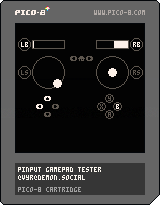

# Pinput


Ever wish [PICO-8](https://www.lexaloffle.com/pico-8.php) had dual analog stick support? Me too. Pinput is a Lua library that works with an external helper app to provide [XInput](https://docs.microsoft.com/en-us/windows/win32/xinput/getting-started-with-xinput)-like gamepad support to an unmodifed copy of PICO-8.

## Instructions



### macOS

To try it, download the latest release of the Pinput macOS app from this GitHub project, and the above PICO-8 cartridge, which is a gamepad test cartridge. Launch the app, and load and run the cartridge. The Pinput macOS app will ask for user permission to debug other apps when first launched, but it does not need root access to work. It is not signed or notarized yet and you may need to [override Gatekeeper](https://support.apple.com/en-us/HT202491) to run it.

Once both the app and the cartridge are running, the cartridge should switch from displaying `waiting for pinput connection...` to showing the state of player 1's gamepad. Try moving the sticks and pressing some buttons, and the display should update.

The app displays the process ID of whatever PICO-8 process it found that has the Pinput magic in its GPIO area, and also the name of the gamepad being used by player 1. If you don't see a gamepad, make sure yours is actually on.

### Windows

Download the latest release for your version of Windows from this Github project, and run it in your console. It will print `Couldn't find a running PICO-8 process!` every second.

Now open PICO-8. The console app should switch to printing something like this (the numbers may be different), indicating that it has found PICO-8 but that Pinput has not yet been initialized by the cartridge:

```
PICO-8 PID = 4260
PICO-8 module = 0000000000400000
    lpBaseOfDll = 0000000000400000
    SizeOfImage = 5206016
    EntryPoint = 00000000004014C0
Couldn't find Pinput magic!
Couldn't find Pinput magic in PICO-8 process with PID 4260!
```

Load and run a Pinput-enabled cartridge. The console app should print a final `pinputMagicOffset = 45db9c` (or some similar number) and your gamepad should start working in PICO-8.

The Windows version should not need or ask for any permissions not normally granted by Windows.

### web

Include the `web/pinput.js` module in your [exported web cartridge](https://www.lexaloffle.com/dl/docs/pico-8_manual.html#Web_Applications_) somehow, and call its `.init()` method. The same client code will work with both desktop and web versions.

Want to try it right now? Connect a gamepad and [run the gamepad test cartridge in your browser](https://vyrcossont.github.io/Pinput).

Alternatively check this repo out, run `python3 -m http.server 8080` in the repo to serve it locally, and run `open http://localhost:8080/docs/` (or `xdg-open` on Linux, or `start` on Windows) to open the test cartridge in your browser. You may need to press some buttons to get your gamepad to start talking to your browser.

### PICO-8 development

To add Pinput support to your own cartridge, take a look at [`pinput.lua`](PICO-8/pinput.lua) All of the functions and constants prefixed with `pi_` are the Pinput client code proper, and you can copy or `#include pinput.lua` that code right into your cartridge to use it yourself.

Call `pi_init()` to put the Pinput magic bytes into GPIO so one of the helper apps can find it and start communicating, and call `pi_btn()`, `pi_trigger()`, `pi_axis()`, etc. to read button, trigger, and thumbstick axis values. Note that (as in XInput) trigger values are in the range [0, 255] and axes are in the range [-32768, 32767].

```lua
-- read player 2's left trigger and scale it to [0, 1]
local t = pi_trigger(1, pi_lt) / 0xff
```

Consult [`pinput_tester.p8`](PICO-8/pinput_tester.p8) (the test cartridge) for more usage examples.

## Current status

### macOS

Supports reading all buttons, sticks, triggers, and the battery level and charging status, from up to 8 controllers. It doesn't try to suppress PICO-8's own gamepad API, and whatever button PICO-8 uses to open the menu will still open the menu.

The current implementation has been tested with macOS 11.6 on Intel hardware only, but targets a minimum macOS version of 11.1. Please let me know if you get this running on Apple Silicon.

Controller-wise, I've tested it with an Xbox Wireless Controller with Bluetooth (model 1708) and a DualShock 4 (model CUH-ZCT2), but it should work with any controller supported by Apple's Game Controller API. (Check [Apple's pairing instructions](https://support.apple.com/en-us/HT210414) if you get stuck.) Note that this does _not_ include vanilla USB or Bluetooth HID gamepads, or classic XInput devices like 360 gamepads.

### Windows

Supports reading all buttons, sticks, triggers, and the battery level, from up to 4 XInput controllers. Non-XInput controllers are not supported yet.

The current implementation has been tested on Windows 10 Build 19042 and an x64 (aka amd64) machine, with both the x86 and x64 release builds of the Pinput console app. It may or may not run on older versions of Windows. It doesn't use anything newer than Vista's version of XInput, so it should be portable to older versions, but I don't have any older machines to test on.

### web

Supports reading all buttons, sticks, and triggers. No battery information is available through the Web Gamepad API, so that doesn't work.

Known not to work with the Xbox Wireless Controller with Bluetooth (model 1708) when used with Firefox for macOS, due to incorrect button mappings for that controller. Chrome and Safari for macOS work as expected.

The DualShock 4 (model CUH-ZCT2) does work correctly in Firefox, Chrome, and Safari for macOS.

The Logitech F310 in DirectInput mode works in Firefox, Chrome, and Safari for macOS. It does not work in XInput mode. Note that in DirectInput mode, the triggers act as digital buttons (reporting either min or max values) and the guide button is inaccessible. Additionally, the analog/digital mode switch on the front should be set to analog (light off).

## Future goals

- Rumble support
- Windows GUI helper app
- Linux helper app

## Development notes

I've been posting notes on this project in [this Mastodon thread](https://demon.social/@vyr/106893191617500313).

## Licensing and attributions

The MIT license applies to the Pinput helper apps, demo cartridges, and client code. However, given the prevalence of the [CC4-BY-NC-SA license](https://creativecommons.org/licenses/by-nc-sa/4.0/) [on the PICO-8 BBS](https://www.lexaloffle.com/info.php?page=tos), you may opt to use that for Pinput demo cartridges and client code instead.

The gamepad logo is derived from [a public domain work by `carlosmtnz` on OpenClipArt](https://demon.social/web/statuses/106893191617500313).
