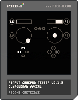

# Pinput

Ever wish [PICO-8](https://www.lexaloffle.com/pico-8.php) had dual analog stick support? Me too. Pinput is a Lua library that works with an external helper app to provide [XInput](https://docs.microsoft.com/en-us/windows/win32/xinput/getting-started-with-xinput)-like gamepad support to an unmodifed copy of PICO-8.

## Instructions

### macOS

To try it, download the latest release of the Pinput macOS app from this GitHub project, and the above PICO-8 cartridge, which is a gamepad test cartridge. Launch the app, and load and run the cartridge. The Pinput macOS app will ask for user permission to debug other apps when first launched, but it does not need root access to work. It is not signed or notarized yet and you may need to [override Gatekeeper](https://support.apple.com/en-us/HT202491) to run it.

Once both the app and the cartridge are running, the cartridge should switch from displaying `waiting for pinput connection...` to showing the state of player 1's gamepad. Try moving the sticks and pressing some buttons, and the display should update.

The app displays the process ID of whatever PICO-8 process it found that has the Pinput magic in its GPIO area, and also the name of the gamepad being used by player 1. If you don't see a gamepad, make sure yours is actually on.

### web

Include the `web/pinput.js` module in your exported cartridge somehow and call its `.init()` method. The same client code will work with both desktop and web versions.

To try my exported cartridge, check this repo out, run `python3 -m http.server 8080` in the repo to serve it locally, and run `open http://localhost:8080/PICO-8/pinput_tester_html/` (or `xdg-open` on Linux, or `start` on Windows) to open the test cartridge in your browser. You may need to press some buttons to get your gamepad to start talking to your browser.

### PICO-8 development

To add Pinput support to your own cartridge, inspect mine, and take a look at the second tab. All of the functions and constants prefixed with `pi_` are the Pinput client code proper, and you should be able to copy that tab right into your cartridge to use it yourself.

## Current status

### macOS

Supports reading all buttons, sticks, triggers, and the battery level and charging status, from up to 8 controllers. It doesn't try to suppress PICO-8's own gamepad API, and whatever button PICO-8 uses to open the menu will still open the menu.

The current implementation has been tested with macOS 11.6 on Intel hardware only, but targets a minimum macOS version of 11.1. Please let me know if you get this running on Apple Silicon.

Controller-wise, I've tested it with an Xbox Wireless Controller with Bluetooth (model 1708) and a DualShock 4 (model CUH-ZCT2), but it should work with any controller supported by Apple's Game Controller API. (Check [Apple's pairing instructions](https://support.apple.com/en-us/HT210414) if you get stuck.) Note that this does _not_ include vanilla USB or Bluetooth HID gamepads, or classic XInput devices like 360 gamepads.

### web

Buttons only. Known not to work with Firefox on macOS due to incorrect button mappings on (at least) the Xbox model 1708 controller. Chrome and Safari on macOS do work.

## Future goals

- Rumble support
- Windows helper app
- Linux helper app
- JavaScript helper code that can be added to [exported web cartridges](https://www.lexaloffle.com/dl/docs/pico-8_manual.html#Web_Applications_)

## Development notes

I've been posting notes on this project in [this Mastodon thread](https://demon.social/@vyr/106893191617500313).

## Licensing and attributions

The MIT license applies to the Pinput helper apps, demo cartridges, and client code. However, given the prevalence of the [CC4-BY-NC-SA license](https://creativecommons.org/licenses/by-nc-sa/4.0/) [on the PICO-8 BBS](https://www.lexaloffle.com/info.php?page=tos), you may opt to use that for Pinput demo cartridges and client code instead.

The gamepad logo is derived from [a public domain work by `carlosmtnz` on OpenClipArt](https://demon.social/web/statuses/106893191617500313).
